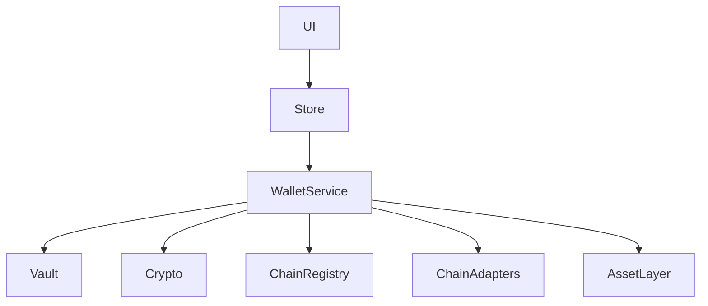

# XQ Wallet

> **Security First. Multi-VM by Design.**

A modern, open-source cryptocurrency wallet built with a security-first
architecture and native multi-VM support.

## Overview

XQ Wallet is a modular wallet architecture designed around clean
architecture principles, strong type safety, and comprehensive automated
testing.

**Current status**

- 🚧 Active development
- ✅ Sprint 1 completed
- 🚧 Sprint 2 in progress

## Features

- HD Wallet (BIP-39)
- Hierarchical Deterministic key derivation
- Secure Vault
- Wallet Engine
- Multi-VM Architecture
  - Native
  - EVM
  - SVM
- Chain Registry
- Chain Adapter Layer
- Asset Layer
- Portfolio Foundation
- Zustand State Management
- Onboarding Flow

## Validation

Item Status

---

Unit Tests ✅ 894 Passing
TypeScript ✅ Clean
ESLint ✅ Clean
Production Build ✅ Passing

## Architecture



## Project Structure

```text
src/
├── app/
├── components/
├── core/
│   ├── asset/
│   ├── chain/
│   │   └── adapters/
│   ├── crypto/
│   ├── vault/
│   └── wallet/
├── domain/
└── lib/
```

## Technology Stack

- TypeScript
- Next.js 15
- React
- Tailwind CSS
- Zustand
- Vitest
- ESLint

## Getting Started

```bash
git clone https://github.com/satoshi-Qore/xq-wallet.git
cd xq-wallet
npm install
npm run dev
```

## Available Scripts

```bash
npm run dev
npm run build
npm test
npm run lint
npm run type-check
```

## Development Workflow

```text
Plan
 ↓
Architecture
 ↓
Implementation
 ↓
Tests
 ↓
Build
 ↓
Lint
 ↓
Type Check
 ↓
Commit
 ↓
Push
```

## Roadmap

### Completed

- Wallet Engine
- Vault
- Cryptography
- Chain Registry
- Multi-VM
- Chain Adapters
- Asset Layer
- Portfolio Foundation
- Onboarding

### Planned

- Transaction Layer
- RPC Integration
- Live Balance Retrieval
- Transaction History
- Fee Estimation
- Hardware Wallet Support

## Contributing

Contributions are welcome.

Before opening a pull request:

- Run all tests
- Ensure the build succeeds
- Ensure ESLint passes
- Ensure TypeScript passes
- Include tests for new functionality

## License

MIT License

## Vision

XQ Wallet is being developed incrementally with a strong focus on
architecture, maintainability, security, and testability. Every
completed sprint is fully validated before moving forward.

---

**Security First. Multi-VM by Design.**
